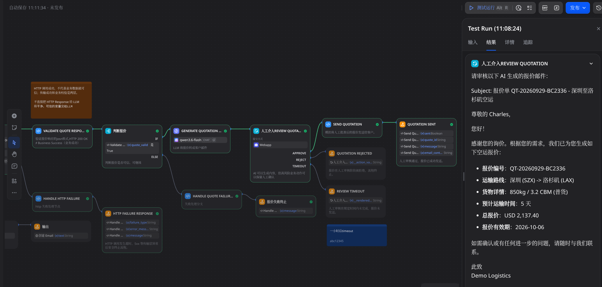

# AI 物流询盘报价工作流

这是一个基于 **Dify + FastAPI** 的物流询盘报价自动化 Demo。

它覆盖自然语言询盘 → 参数提取 → 确定性校验 → 运价 API → 报价响应验证 → 报价邮件生成 → Human-in-the-loop → 模拟发送的完整链路。**LLM 不负责价格计算**；价格、字段校验、异常边界和审批状态均由确定性代码控制。

> 项目定位：production-minded、可运行、可测试的求职作品集 Demo，不是 production-ready 商业运价系统。

## 项目演示 / Demo

当前仓库提供可导入的 Dify DSL：[dify/ai-logistics-quotation-workflow.yml](dify/ai-logistics-quotation-workflow.yml)。

## 为什么做这个项目

货代客户通常用自然语言描述起点、终点、重量、体积、货物类型和运输方式，信息可能缺失或表达不统一。真实系统不能让 LLM 自行补全字段、计算价格或直接向客户发送报价。

本项目将职责拆分为：

- **语言理解交给 LLM**：提取询盘字段、生成补充信息邮件和报价邮件。
- **业务规则交给 Code/API**：检查必填字段、匹配航线、计算价格、验证报价响应。
- **外部报价交给 HTTP API**：通过 FastAPI 模拟企业运价系统。
- **客户动作交给人工审批**：批准后才执行模拟发送；Reject 和 Timeout 均 fail closed。

## 核心设计

| 设计边界 | 实现 |
|---|---|
| LLM vs deterministic code | LLM 处理非确定性语言任务；Python 处理价格与规则 |
| HTTP transport validation | Timeout、HTTP 5xx 进入独立 transport failure 分支 |
| JSON validation | HTTP 200 的响应仍需先解析和检查字段 |
| Business validation | total_price 必须大于 0，业务无效数据不会进入 LLM |
| Human-in-the-loop | 客户可见动作前必须人工 Approve |
| Fail closed | Reject、Review Timeout 和验证失败均不会发送 |
| Request tracing | Dify workflow_run_id 作为 X-Request-ID 贯穿 API 日志 |

关键原则：**HTTP success != business success，外部数据进入 LLM 前必须验证。**

## 工作流架构

~~~mermaid
flowchart TD
    A[客户自然语言询盘] --> B[LLM: Parameter Extractor]
    B --> C[Code: 询盘字段校验]
    C -->|缺少必要信息| D[LLM: 补充信息邮件]
    D --> E[Clarification End]

    C -->|字段完整| F[HTTP: FastAPI 运价 API]
    F -->|Timeout / HTTP 5xx| G[Transport Failure End]
    F -->|HTTP Response| H[Code: JSON + Business Validation]
    H -->|Invalid JSON / Business Invalid| I[Quote Failure End]

    H -->|报价有效| J[LLM: 报价邮件]
    J --> K[Human Input: Review]
    K -->|Approve| L[Code: 模拟发送]
    L --> M[Quotation Sent]
    K -->|Reject| N[Quotation Rejected]
    K -->|Timeout| O[Review Timeout]
~~~

Transport failure 与 Business failure 是两类独立问题，不共用一个模糊的异常分支。

## 正常流程示例

客户询盘：

> Hi, I need to ship 850 kg / 3.2 CBM general cargo by air from Shenzhen to Los Angeles.

结构化字段：

~~~json
{
  "origin": "Shenzhen",
  "destination": "Los Angeles",
  "weight_kg": 850,
  "volume_cbm": 3.2,
  "cargo_type": "general cargo",
  "transport_mode": "air"
}
~~~

FastAPI 确定性报价结果：

~~~json
{
  "currency": "USD",
  "base_rate": 1832.50,
  "fuel_surcharge": 219.90,
  "handling_fee": 85.00,
  "total_price": 2137.40,
  "estimated_transit_days": 5,
  "provider": "Demo Logistics"
}
~~~

报价通过 JSON 与 Business Validation 后，LLM 只能基于已验证字段生成客户邮件，不能修改金额。邮件进入 Human Review；Approve 后进入 Quotation Sent，Reject 或 Timeout 均终止。

中文询盘生成中文客户邮件，英文询盘生成英文客户邮件。深圳/洛杉矶 与 SZX/LAX 会在 API 路由边界确定性归一化到同一条航线，因此得到相同价格与运输时效。

## 报价规则

- 空运计费重量：max(weight_kg, volume_cbm × 167)
- 海运计费体积：max(volume_cbm, weight_kg ÷ 1000)
- 已知航线使用固定 Demo rate table，未知航线使用 deterministic fallback
- 空运燃油附加费 12%，海运 8%
- 空运 handling fee 为 USD 85，海运为 USD 120
- Dangerous cargo 增加 USD 350 handling fee
- 最低总价为 USD 1,000
- 未提供 transport_mode 时默认 air，并在客户邮件中披露该假设

这些规则用于展示工程边界，不代表真实商业运价。

## 异常处理

| 场景 | 系统行为 |
|---|---|
| Missing required information | 不调用报价 API，生成补充信息邮件 |
| HTTP 5xx | 重试后进入 Transport Failure |
| Timeout | 有界超时与重试后进入 Transport Failure |
| Invalid JSON | HTTP 成功但 JSON 解析失败，进入 Quote Failure |
| Business-invalid quote | HTTP 200 且 JSON 合法，但 total_price = 0，仍被拒绝 |
| Human Reject | fail closed，不执行模拟发送 |
| Human Review Timeout | fail closed，不执行模拟发送 |

Mock API 的 simulate 参数支持 none、slow、timeout、error_500、invalid_json 和 invalid_business。

## 已验证

- 自动化测试：**14 passed**
- Python source 与 Dify Code nodes 可编译
- Docker Compose 配置可解析
- Dify DSL YAML 可解析
- 人工 Smoke Test：Happy Path、invalid_business、timeout
- 当前 source 与运行容器对标准 Shenzhen → Los Angeles 请求均返回 USD 2,137.40 / 5 days

## 技术栈

- Dify Community Edition 1.17.1
- Python 3.11+
- FastAPI / Pydantic / Uvicorn
- Docker / Docker Compose
- pytest / HTTPX
- HTTP / JSON / Structured Output
- Human-in-the-loop
- Structured logging / Request tracing

## 项目结构

~~~text
app/            FastAPI 服务、请求模型与确定性报价规则
tests/          API 测试与询盘 fixtures
dify/           可导入的 Dify Workflow DSL
docs/           Workflow 调试、Tracing 与网络说明
Dockerfile      API 镜像
compose.yaml    API 服务与 Dify Docker 网络连接
README.md       项目入口文档
~~~

## 快速开始

### 本地运行

~~~bash
git clone https://github.com/doronix/ai-logistics-quotation-workflow.git
cd ai-logistics-quotation-workflow

uv sync --dev
make run
~~~

API 地址：<http://127.0.0.1:18000>

Health check：

~~~bash
curl -i http://127.0.0.1:18000/health
~~~

标准报价：

~~~bash
curl -X POST http://127.0.0.1:18000/api/v1/rates/quote \
  -H 'Content-Type: application/json' \
  -H 'X-Request-ID: readme-demo-001' \
  -d '{
    "origin": "Shenzhen",
    "destination": "Los Angeles",
    "weight_kg": 850,
    "volume_cbm": 3.2,
    "cargo_type": "general cargo",
    "transport_mode": "air"
  }'
~~~

### Docker 运行

~~~bash
cp .env.example .env
docker compose up -d --build
curl -i http://127.0.0.1:18000/health
~~~

Host 访问地址为 127.0.0.1:18000；Dify Docker 网络内使用：

~~~text
http://ai-quotation-api:8000/api/v1/rates/quote
~~~

## 导入 Dify Workflow

在 Dify Community Edition 1.17.1 中导入：

~~~text
dify/ai-logistics-quotation-workflow.yml
~~~

导入后需要配置兼容的模型 provider 和凭据。DSL 当前引用 Tongyi 模型；FastAPI 报价服务本身不依赖具体 LLM provider。

Dify 的 HTTP Request 会经过 SSRF proxy。不要全局关闭 SSRF protection；应先检查实际 Docker network CIDR，再只允许必要的私有 CIDR。详细步骤见 [docs/dify-workflow.md](docs/dify-workflow.md)。

## 测试

~~~bash
uv run pytest
~~~

当前结果：

~~~text
14 passed
~~~

## 安全与生产边界

- Demo 不发送真实客户邮件，Send Quotation 仅为模拟动作。
- Customer-facing action 前必须 Human approval。
- Reject、Timeout 和验证失败均 fail closed。
- 本地 .env 与 secrets 不进入 Git。
- SSRF protection 不应全局关闭，Docker private CIDR 应最小 allowlist。
- API 未实现生产级 authentication、authorization、rate limiting 或持久化 audit trail。
- Demo rate table 不是真实 carrier/rate integration；生产环境需接入企业运价、邮件/CRM 与集中式 observability。
